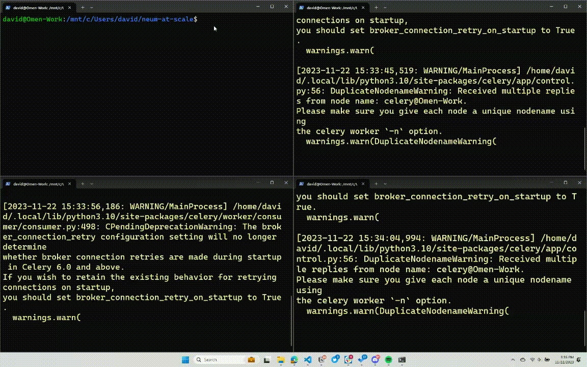

# Neum AI - At Scale

This repo contains a sample of a distributed architecture solution using Neum AI with Celery and Redis Queues. By design, Neum AI framework provides constructs to parallelize workloads in order to process larger data sets. 


## Getting started

To leverage this repo, you will need to install dependencies:

```
pip install -r requirements.txt
```

In addition:
- Install the  the [redis CLI](https://redis.io/docs/install/install-redis/install-redis-on-linux/) to run it locally.
- You will need an Open AI API Key for the OpenAI embedding model. To get an API Key visit **[OpenAI](https://platform.openai.com/signup)**. Make sure you have configured billing for the account.
- You will need a Weaviate Cloud Service URL and API Key for the Weavaite vector database. To get a URL and API Key visit [Weaviate Cloud Service](https://console.weaviate.cloud/dashboard).

## Configure connectors

In the `main.py` file, you need to configure the Open AI and Weaviate connectors. 

Alternatively, you can re-configure your pipeline by using [Neum AI connectors](https://docs.neum.ai/components/pipeline).

## Architecture


## Run it locally

To get everything ready to run our solution, we first need to get our `redis` queues running. To do this, we will use the `redis` CLI:

```python
sudo service redis-server start
```

Once we have the `redis` queues running, we can now start our `Celery` based workers. We will have each running on its own command line.

**data_extraction worker**

```python
celery -A tasks worker --concurrency 1 -Q data_extraction
```

**data_processing worker**

```python
celery -A tasks worker --concurrency 1 -Q data_processing
```

**data_embed_ingest worker**

```python
celery -A tasks worker --concurrency 1 -Q data_embed_ingest
```

Once everything is running, we can now trigger out pipeline. This will distribute the tasks from it into the different queues as it processes the data.

```python
python main.py
```


